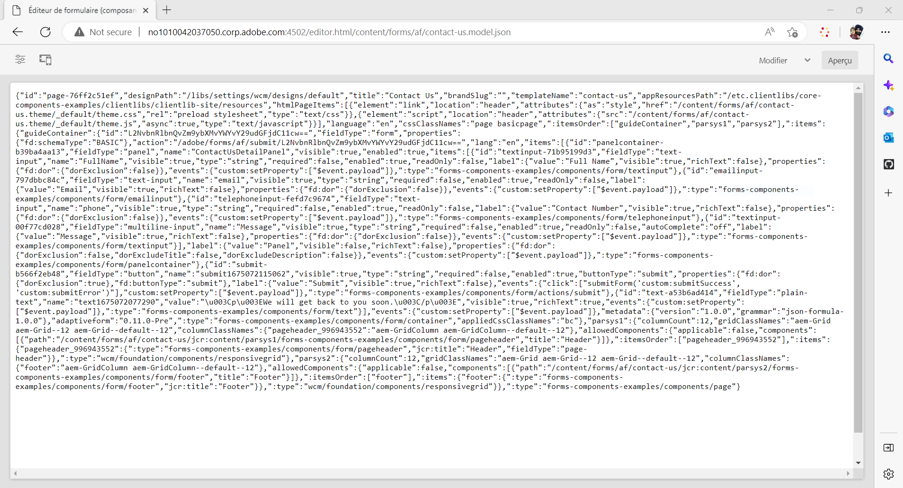

# Créer un formulaire adaptatif découplé à l’aide de l’éditeur de formulaires adaptatifs {#create-a-headless-adaptive-form-using-adaptive-forms-editor}

AEM Forms as a Cloud Service propose un éditeur convivial pour créer des formulaires adaptatifs découplés. Avec plus de 24 composants principaux disponibles, vous pouvez facilement créer un formulaire en faisant glisser des composants dans l’éditeur. De plus, l’éditeur de règles vous permet d’ajouter des validations à vos champs de formulaire.

>[!NOTE]
>
>Si vous découvrez les formulaires adaptatifs découplés, commencez par le tutoriel [Créer et publier un formulaire découplé à l’aide du kit de démarrage](create-and-publish-a-headless-form.md). Il couvre les principes de base et vous guide tout au long de la conception manuelle d’un formulaire avant de passer à l’éditeur de Forms adaptatif pour les formulaires découplés.

Pour créer un formulaire adaptatif découplé à l’aide de l’éditeur de Forms adaptatif, procédez comme suit :

## Avant de commencer

Pour créer un formulaire adaptatif à l’aide de l’éditeur de Forms adaptatif, vous avez besoin des éléments suivants :

**Pour AEM Forms 6.5 :**

* Accès à une instance d’auteur AEM 6.5.16.0 ou ultérieure Forms.

* Composants principaux des formulaires adaptatifs

* Modèle de composants principaux des formulaires adaptatifs

* Thème de formulaire adaptatif pour le modèle basé sur les composants principaux

* Ajoutez vos utilisateurs au groupe [!DNL forms-users]. Les membres du groupe [!DNL forms-users] sont autorisés à créer un formulaire adaptatif.

**Pour AEM Forms as a Cloud Service**

* Accès à un environnement d’[instance de création AEM Forms as a Cloud Service](https://experienceleague.adobe.com/fr/docs/experience-manager-cloud-service/content/forms/setup-configure-migrate/setup-forms-cloud-service) ou de [SDK AEM Forms as a Cloud Service local](https://experienceleague.adobe.com/fr/docs/experience-manager-cloud-service/content/forms/setup-configure-migrate/setup-local-development-environment)

* **Modèle de formulaire adaptatif** : un modèle fournit une structure de base et définit l’aspect (dispositions et styles) d’un formulaire adaptatif. Il comporte des composants pré-formatés contenant certaines propriétés et une certaine structure de contenu. Il fournit également les options permettant de définir un thème et d’envoyer une action. Le thème définit l’aspect et l’action d’envoi définit l’action à entreprendre lors de l’envoi d’un formulaire adaptatif. Par exemple, l’envoi des données collectées à une source de données. Le service cloud fournit un modèle prêt à l’emploi, sans nom :

   * Le modèle `blank Adaptive Forms (Core Components)` est inclus dans chaque nouveau programme AEM Forms as a Cloud Service.
   * Vous pouvez également [créer un modèle de formulaire adaptatif (composants principaux)](https://experienceleague.adobe.com/fr/docs/experience-manager-cloud-service/content/forms/adaptive-forms-authoring/authoring-adaptive-forms-foundation-components/create-an-adaptive-form-on-forms-cs/template-editor) à partir de zéro.

* **Un thème de formulaire adaptatif** : un thème contient des détails de style pour les composants et les panneaux. Ces styles incluent les propriétés telles que les couleurs d’arrière-plan, les couleurs d’état, la transparence, l’alignement et la taille. Lorsque vous appliquez un thème, le style spécifié se reflète sur les composants correspondants.  Le modèle `Canvas` est inclus dans chaque nouveau programme AEM Forms as a Cloud Service.

* **Autorisations** : ajoutez vos utilisateurs et utilisatrices au groupe [!DNL forms-users]. Les membres du groupe [!DNL forms-users] ont les autorisations de créer un formulaire adaptatif. Pour obtenir la liste détaillée des formulaires pour des groupes d’utilisateurs spécifiques, voir [Groupes et autorisations](https://experienceleague.adobe.com/fr/docs/experience-manager-cloud-service/content/forms/setup-configure-migrate/forms-groups-privileges-tasks).

## Créer un formulaire adaptatif {#create-an-adaptive-form-components}

1. Connectez-vous à votre instance de création [!DNL Experience Manager Forms].

1. Entrez vos informations d’identification dans la page de connexion d’Experience Manager. Une fois connecté, dans le coin supérieur gauche, appuyez sur **[!UICONTROL Adobe Experience Manager]** > **[!UICONTROL Formulaires]** > **[!UICONTROL Formulaires et documents.]**.

1. Appuyez sur **[!UICONTROL Créer]** > **[!UICONTROL Formulaires adaptatifs]**. Cette action permet d’ouvrir l’assistant. Dans l’onglet Source, sélectionnez un modèle :

   

   Lorsque vous sélectionnez un modèle, un thème et l’action d’envoi spécifiée dans le modèle sont sélectionnés automatiquement. Le bouton **[!UICONTROL Créer]** est activé. Vous pouvez accéder aux onglets **[!UICONTROL Style]** ou **[!UICONTROL Envoi]** pour sélectionner un autre thème ou envoyer une action. Si le modèle sélectionné ne spécifie pas de thème, le bouton de création reste désactivé. Vous pouvez accéder à l’onglet **[!UICONTROL Styles]** pour sélectionner un thème manuellement.

1. Dans l’onglet **[!UICONTROL Style]**, sélectionnez un thème :

   * Lorsque le modèle sélectionné spécifie un thème, celui-ci est automatiquement sélectionné dans l’assistant. Vous pouvez également choisir un thème différent dans l’onglet Style.

   * Si le modèle sélectionné ne spécifie aucun thème, vous pouvez utiliser l’onglet Style pour en choisir un. Le bouton **[!UICONTROL Créer]** n’est activé qu’après la sélection d’un thème.

1. (Facultatif) Dans l’onglet Données, sélectionnez un modèle de données :

   * **Modèle de données de formulaire** : un [modèle de données de formulaire](https://experienceleague.adobe.com/fr/docs/experience-manager-cloud-service/content/forms/integrate/use-form-data-model/data-integration) vous permet d’intégrer des entités et des services provenant de sources de données disparates à un formulaire adaptatif. Choisissez le modèle de données de formulaire si le formulaire adaptatif que vous créez implique l’extraction et l’écriture de données depuis et vers plusieurs sources de données.

   * **Schéma JSON** : [schéma JSON](https://experienceleague.adobe.com/fr/docs/experience-manager-cloud-service/content/forms/adaptive-forms-authoring/authoring-adaptive-forms-foundation-components/create-an-adaptive-form-on-forms-cs/adaptive-form-json-schema-form-model) le Forms adaptatif permet une intégration transparente au système back-end de votre entreprise en vous permettant d’associer un schéma JSON, qui représente la structure des données générées ou consommées. Cette association permet aux auteurs d’ajouter du contenu de manière dynamique au formulaire adaptatif à l’aide des éléments du schéma. Lors de la création, vous pouvez accéder rapidement aux éléments de schéma dans l’onglet Objets de modèle de données de l’explorateur de contenu. Lorsque vous créez un formulaire adaptatif, l’éditeur ajoute automatiquement tous les champs.

   Par défaut, tous les champs du schéma JSON associé sont automatiquement sélectionnés et convertis en composants de formulaire adaptatif correspondants, ce qui simplifie le processus de création. L’assistant vous permet en outre de choisir, au moyen de cases à cocher, les champs à inclure dans le formulaire adaptatif.

1. Dans l’onglet **[!UICONTROL Envoi]**, sélectionnez une action d’envoi :

   * Lorsque vous sélectionnez un modèle, l’action d’envoi spécifiée dans le modèle est sélectionnée automatiquement. Vous pouvez sélectionner une autre action d’envoi dans l’onglet Envoi. L’onglet **[!UICONTROL Envoi]** affiche toutes les actions d’envoi disponibles.

   * Lorsque le modèle sélectionné ne spécifie aucune action d’envoi, vous pouvez utiliser l’onglet **[!UICONTROL Envoi]** pour sélectionner une action d’envoi

1. (Facultatif) Dans l’onglet **[!UICONTROL Diffusion]**, vous pouvez spécifier une date de publication ou de d’annulation de publication pour un formulaire adaptatif.

1. Appuyez sur **[!UICONTROL Créer]**. Une boîte de dialogue pour spécifier le titre, le nom et l’emplacement d’enregistrement du formulaire adaptatif s’affiche :

   * **[!UICONTROL Titre]** Spécifie le nom d’affichage du formulaire. Le titre vous permet d’identifier le formulaire dans l’interface utilisateur [!DNL Experience Manager Forms] d’AEM Forms.
   * **[!UICONTROL Nom :]** indique le nom du formulaire. Un nœud portant le nom spécifié est créé dans le référentiel. Lorsque vous commencez à saisir un titre, la valeur du champ Nom est automatiquement générée. Vous pouvez modifier la valeur suggérée. Le champ Nom ne peut contenir que des caractères alphanumériques, des traits d’union et des traits de soulignement. Toutes les entrées non valides sont remplacées par un trait d’union.
   * **[!UICONTROL Chemin d’accès :]** indique l’emplacement d’enregistrement du formulaire adaptatif. Vous pouvez enregistrer le formulaire adaptatif directement sur `/content/dam/formsanddocuments` ou créer un dossier tel que `/content/dam/formsanddocuments/adaptiveforms` pour enregistrer un formulaire adaptatif. Assurez-vous de créer le dossier avant de l’utiliser dans le chemin d’accès. Le champ **[!UICONTROL Chemin d’accès]** ne crée pas de dossier automatiquement.

1. Appuyez sur **[!UICONTROL Créer]**. Un formulaire adaptatif est créé et s’ouvre dans l’éditeur de formulaires adaptatifs. L’éditeur affiche le contenu disponible dans le modèle.  En fonction du type de formulaire adaptatif, les éléments de formulaire présents dans le <!--XFA form template, XML schema or --> schéma JSON ou le modèle de données de formulaire associé sont affichés dans l’onglet **[!UICONTROL Objets de modèle de données]** de l’**[!UICONTROL explorateur de contenu]** dans la barre latérale. Vous pouvez également faire glisser ces éléments pour créer votre formulaire adaptatif.

Vous pouvez maintenant faire glisser et déposer les composants de Forms adaptatif dans le conteneur de Forms adaptatif pour concevoir et créer le formulaire.

## Afficher le rendu JSON d’un formulaire adaptatif {#preview-form}

Sélectionnez le formulaire adaptatif et appuyez sur **Prévisualiser**. La prévisualisation du formulaire s’affiche. Pour afficher la définition du formulaire (JSON), remplacez l’extension .html dans l’URL par .model.json

Par exemple, http://[author-server]:[port]/editor.html/content/forms/af/contact-us.model.json

Vous pouvez utiliser l’API [getForm](https://opensource.adobe.com/aem-forms-af-runtime/api/#tag/Get-Form-Definition) des formulaires adaptatifs découplés pour récupérer la définition de formulaire (JSON) et l’utiliser dans votre application.

