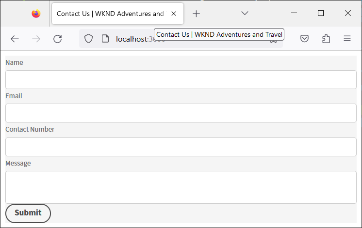

# Créer et prévisualiser un formulaire découplé à l’aide d’une application React {#introduction}

<!-- Missing image ALT image tags -->

Le kit de démarrage vous permet de commencer rapidement à l’aide d’une application React. Vous êtes libre de développer et d’utiliser des formulaires adaptatifs découplés dans Angular, Vanilla JS et d’autres environnements de développement de votre choix.

Commencer avec des formulaires adaptatifs découplés est assez facile et rapide. Clonez le projet React prêt à l’emploi, installez les dépendances et exécutez le projet. Un formulaire adaptatif découplé est intégré à une application React opérationnelle. Vous pouvez utiliser l’exemple de projet react pour créer et tester les formulaires adaptatifs découplés avant de les déployer dans un environnement de production.

C’est parti !

>[!NOTE]
>
>
> Ce guide de prise en main utilise une application React. Vous êtes libre d’utiliser la technologie ou le langage de programmation de votre choix pour utiliser les formulaires adaptatifs découplés.

## Avant de commencer {#pre-requisites}

Pour créer et exécuter une application React, les éléments suivants doivent être installés sur votre ordinateur :

* Installez la [dernière version de Git](https://git-scm.com/downloads). Si vous découvrez Git, consultez l’article [Installer Git](https://git-scm.com/book/en/v2/Getting-Started-Installing-Git).

* Installez [Node.js 16.13.0 ou version ultérieure](https://nodejs.org/en/download/). <!-- URL is 404!! If you are new to Node.js, see [How to install Node.js](https://nodejs.dev/en/learn/how-to-install-nodejs). -->

## Prise en main

Une fois les conditions remplies, procédez comme suit pour commencer :

1. [Configuration du kit de démarrage de formulaires adaptatifs découplés](#setup)

1. [Prévisualiser le formulaire adaptatif découplé inclus dans le kit de démarrage](#preview)

1. [Création et rendu de votre propre formulaire adaptatif découplé](#custom)


## &#x200B;1. Configuration du kit de démarrage de formulaires adaptatifs découplés {#install}

Le kit de démarrage est une application React avec un exemple de formulaire adaptatif découplé et les bibliothèques correspondantes. Utilisez le kit pour développer et tester vos formulaires adaptatifs découplés et les composants React correspondants. Exécutez les commandes suivantes pour configurer le kit de démarrage des formulaires adaptatifs découplés :

1. Ouvrez une invite de commandes et exécutez la commande suivante :

   ```shell
   git clone https://github.com/adobe/react-starter-kit-aem-headless-forms
   ```

   La commande crée un répertoire appelé **react-starter-kit-aem-headless-forms** à votre emplacement actuel et y clone l’application de démarrage React des formulaires adaptatifs découplés. Outre les configurations et la liste des dépendances requises pour générer le formulaire, le répertoire comprend le contenu important suivant :

   * **Exemple de formulaire** : le kit de démarrage comprend un exemple de formulaire de demande de prêt. Pour afficher le formulaire (définition de formulaire) inclus dans l’application, ouvrez le fichier `/react-starter-kit-aem-headless-forms/form-definations/form-model.json`.
   * **Exemples de composants React** : le kit de démarrage comprend des exemples de composants React pour le texte enrichi et le curseur. Ce guide vous aide à créer vos propres composants personnalisés à l’aide de ces composants de texte enrichi et de curseur.
   * **Mappings.ts** : le fichier mappings.ts vous aide à mapper des composants personnalisés à des champs de formulaire. Par exemple, mappez un champ d’exécution numérique pas à pas avec un composant d’évaluation.
   * **Configurations d’environnement** : les configurations d’environnement vous permettent de rendre un formulaire inclus dans le kit de démarrage ou de récupérer un formulaire à partir d’un serveur AEM Forms.

   

   >[!NOTE]
   >
   > 
   > Les exemples de documents sont basés sur VSCode. Vous êtes libre d’utiliser n’importe quel éditeur de code de texte brut.


1. Accédez au répertoire **response-starter-kit-aem-headless-forms** et exécutez la commande suivante pour installer les dépendances :

   ```shell
   npm install
   ```

   La commande télécharge chaque package et bibliothèque requis pour créer et exécuter l’application, y compris les bibliothèques de formulaires adaptatifs découplés (@aemforms/af-react-renderer, @aemforms/af-react-components, @adobe/react-spectrum). Il exécute ensuite les validations et conserve les données de chaque instance de formulaire.


   


## &#x200B;2. Prévisualiser le formulaire adaptatif découplé {#preview}

Après avoir configuré le kit de démarrage, vous pouvez prévisualiser l’exemple de formulaire adaptatif découplé et le remplacer par votre propre formulaire personnalisé. Vous pouvez également configurer le kit de démarrage pour récupérer un formulaire à partir d’un serveur AEM Forms. Pour prévisualiser le formulaire

1. Renommez le fichier `env_template` en fichier `.env`. Assurez-vous également que l’option USE_LOCAL_JSON est définie sur « true ».

   

   <!-- The options in the .env file help you configure source of the forms definantion (.JSON):
    *  To source forms definantion (.JSON) from an AEM Server, set USE_LOCAL_JSON option to false, use the AEM_URL option to specify URL  of your AEM Server, and set the AEM_FORM_PATH option to path of your adaptive form.
    *  To source forms definantion (.JSON) form-model.json file included in the starter-kit, set USE_LOCAL_JSON option to false. -->

1. Utilisez la commande suivante pour exécuter l’application :

   ```shell
     npm start
   ```


   Cette commande démarre un serveur de développement local et ouvre l’exemple de formulaire adaptatif découplé, inclus dans l’application de démarrage, dans votre navigateur web par défaut.

   

   Tout est prêt ! Vous êtes prêt à commencer à développer un formulaire adaptatif découplé personnalisé.

   <!--  As you know, in a headless form the form data and logic are separate from the presentation layer and can be used by any client that can make HTTP requests, such as a mobile app, a static site, or a different web application. The form is often managed and stored on a server, which serves as the backend for the form. The client sends requests to the server to retrieve the form, submit data, and receive updated form data. This allows for greater flexibility and integration with different technologies. You can store and retrive a Headless Adaptive form on an AEM Server  -->

## &#x200B;3. Créer et générer votre propre formulaire adaptatif découplé{#custom}

Un formulaire adaptatif découplé représente le formulaire et ses composants, tels que les champs et les boutons, au format JSON (JavaScript Object Notation). L’avantage du format JSON est qu’il peut être facilement analysé et utilisé par divers langages de programmation, ce qui en fait un moyen pratique d’échanger des données de formulaire entre les systèmes. Pour afficher l’exemple de formulaire adaptatif découplé inclus dans l’application, ouvrez le fichier `/react-starter-kit-aem-headless-forms/form-definations/form-model.json` .

Créons un formulaire `Contact Us` avec quatre champs : « Nom », « Adresse électronique », « Numéro de téléphone » et « Message ». Les champs sont définis comme des objets (éléments) au sein de JSON, chaque objet (élément) ayant des propriétés telles que le type, le libellé, le nom et l’exigence. Le formulaire comporte également un bouton de type « envoyer ». Voici le fichier JSON pour le formulaire.


```JSON
{
  "afModelDefinition": {
    "adaptiveform": "0.10.0",
    "items": [
      {
        "fieldType": "text-input",
        "label": {
          "value": "Name"
        },
        "name": "name"
      },
      {
        "fieldType": "text-input",
        "format": "email",
        "label": {
          "value": "Email"
        },
        "name": "email"
      },
      {
        "fieldType": "text-input",
        "format": "phone",
        "pattern": "[0-9]{10}",
        "label": {
          "value": "Contact Number"
        },
        "name": "Phone"
      },
      {
        "fieldType": "multiline-input",
        "label": {
          "value":"Message"
        },
        "name": "message"
      },
      {
        "fieldType": "button",
        "label":{
          "value": "Submit"
        },
        "name":"submit",
        "events":{
          "click": "submitForm()"
        }
      }
    ],
    "action": "https://eozrmb1rwsmofct.m.pipedream.net",
    "description": "Contact Us",
    "title": "Contact Us",
    "metadata": {
      "grammar": "json-formula-1.0.0",
      "version": "1.0.0"
    }
  }
}
```

>[!NOTE]
>
> * L’attribut « afModelDefinition » n’est nécessaire que pour les applications React et ne fait pas partie de la définition du formulaire.
> * Vous pouvez concevoir manuellement le formulaire JSON ou utiliser l’[éditeur de formulaires adaptatifs AEM (éditeur WYSIWYG de formulaires adaptatifs)](create-a-headless-adaptive-form.md) pour créer et diffuser le formulaire JSON. Dans un environnement de production, AEM Forms se charge de la diffusion du formulaire JSON. Nous y reviendrons plus loin dans cet article.
> * Le tutoriel utilise https://pipedream.com/ pour tester les envois de formulaire. Vous utilisez vos propres points d’entrée ou des points d’entrée tiers approuvés par votre organisation pour recevoir les données d’un formulaire adaptatif découplé.


Pour effectuer le rendu du formulaire, remplacez l’exemple de `/react-starter-kit-aem-headless-forms/form-definations/form-model.json` JSON de formulaire adaptatif découplé par le fichier JSON ci-dessus, enregistrez le fichier, attendez que le kit de démarrage compile et actualise le formulaire.


<!-- Your form is ready. Let's add some validations and make "Name", "Email", and "Message" fields mandatory. -->

Vous avez correctement rendu le formulaire adaptatif découplé.


## Bonus

Définissons le titre de la page web hébergeant le formulaire sur `Contact Us | WKND Adventures and Travel`. Pour modifier le titre, ouvrez le fichier _react-starter-kit-aem-headless-forms/public/index.html_ pour modifier et définir le titre.




## Étape suivante

Par défaut, le kit de démarrage utilise les composants [Spectrum d’Adobe](https://spectrum.adobe.com/) pour générer le formulaire. Vous pouvez créer et utiliser vos propres composants ou des composants tiers. Par exemple, à l’aide de Material UI de Google ou de Chakra UI.

[utilisez l’interface utilisateur Material Google](use-google-material-ui-react-components-to-render-a-headless-form.md) pour effectuer le rendu du formulaire `Contact Us`.


