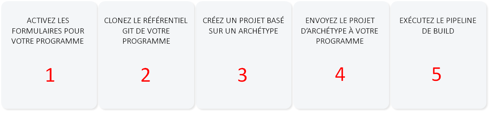
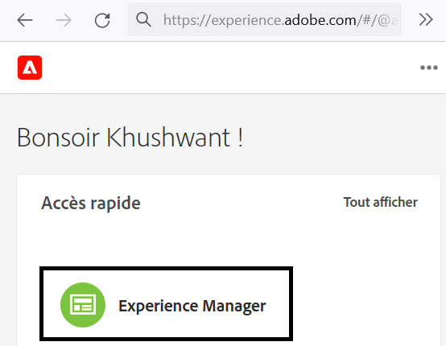
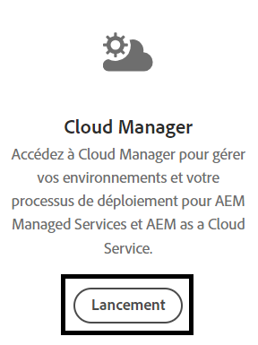
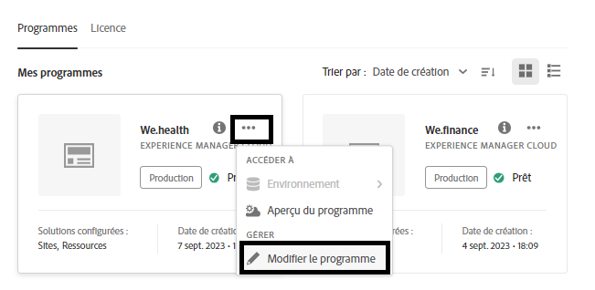
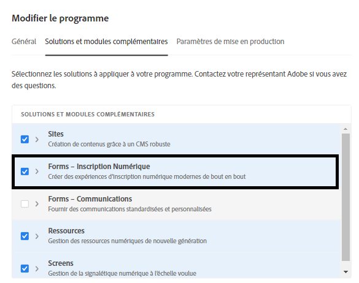
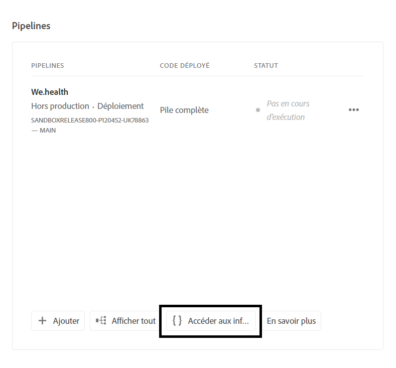
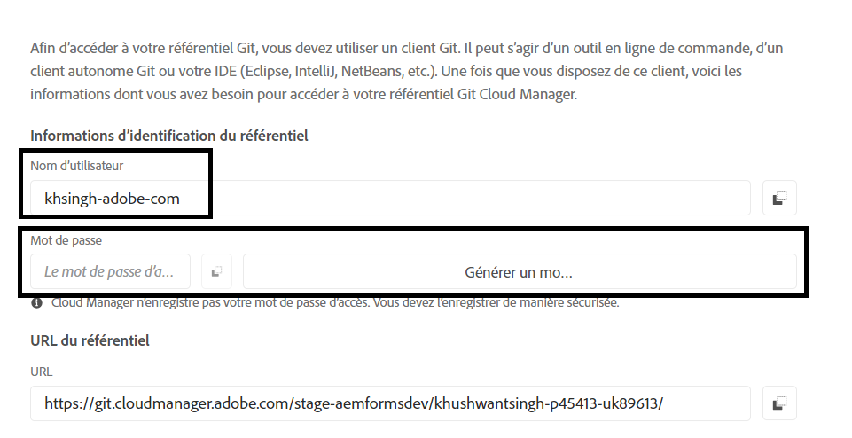
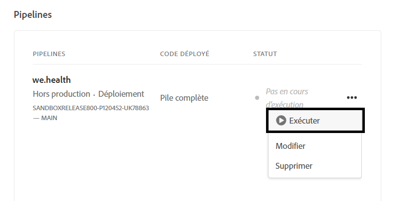

# Configurer l’environnement de développement pour les formulaires adaptatifs découplés sur Cloud Service

<span class="preview"> Cet article est un **TRAVAIL EN COURS**.</span>


Vous êtes prêt à créer et à tester les formulaires adaptatifs découplés sur Cloud Service ? Activez Forms pour votre programme Cloud Service et le tour est joué !

## Avant de commencer

* Installez la [dernière version de Git](https://git-scm.com/downloads) sur votre ordinateur local. Si vous découvrez Git, consultez [Installer Git](https://git-scm.com/book/en/v2/Getting-Started-Installing-Git). Le référentiel Git vous permet d’envoyer les formulaires et le code personnalisé développés dans votre environnement de développement local vers votre environnement de développement Cloud Service.

* Installez [Node.js 16.13.0 ou une version ultérieure](https://nodejs.org/en/download/) sur votre ordinateur local. <!-- URL IS 404! If you are new to Node.js, see [How to install Node.js](https://nodejs.org/en/learn/how-to-install-nodejs). -->


* Créez un programme AEM as a Cloud Service : suivez les étapes 1 à 7 de l’article [Créer un programme](https://experienceleague.adobe.com/fr/docs/experience-manager-cloud-service/content/onboarding/demo-add-on/create-program#create-program) pour créer un programme pour votre organisation.

* Activez le [canal de version préliminaire) pour votre programme Cloud Service](https://experienceleague.adobe.com/fr/docs/experience-manager-cloud-service/content/release-notes/prerelease#cloud-environments).

## Workflow de configuration

Pour activer les formulaires adaptatifs découplés sur votre sandbox Forms as a Cloud Service, activez `Forms - Digital enrolment` solution pour votre programme AEM Cloud Service. Créez ensuite un projet basé sur Archetype 37 ou une version ultérieure sur votre ordinateur local et envoyez-le à votre environnement Forms as a Cloud Service. Le processus complet est le suivant :



### &#x200B;1. Activer Forms pour votre programme

<table style="table-layout:auto">
<tr>
  <td>
  1. Connectez-vous à <a href="https://experience.adobe.com/" > https://experience.adobe.com/ </a> et sélectionnez l’option <b> Experience Manager. </b>

  </td>
  <td>
    <a href="https://experienceleague.adobe.com/fr/docs/experience-manager-cloud-service/content/onboarding/demo-add-on/create-program#create-program">
      
    </a>
    <br>
  </td>
</tr>
<tr>
  <td>
  &#x200B;2. Pour l’option <b> Cloud Manager, </b> cliquez sur <b> Lancer. </b> Une liste des programmes de votre organisation s’affiche.
  </td>
  <td>
    <a href="https://experienceleague.adobe.com/fr/docs/experience-manager-cloud-service/content/onboarding/demo-add-on/create-program#create-program">
      
    </a>
    <br>
  </td>
</tr>
<tr>
  <td>
    &#x200B;3. Pour votre programme, appuyez sur l’icône ... et sélectionnez l’option <b> Modifier le programme </b>. Une boîte de dialogue s’affiche. 
  </td>
  <td>
    <a href="https://experienceleague.adobe.com/fr/docs/experience-manager-cloud-service/content/onboarding/demo-add-on/create-program#create-program">
      
    </a>
    <br>
  </td>
</tr>
<tr>
  <td>
    &#x200B;4. Dans la boîte de dialogue Modifier le programme, accédez à l’onglet <b> Solutions et modules complémentaires, </b> sélectionnez l’option <b> Forms - Inscription numérique </b> et appuyez sur <b> mettre à jour </b>. 
  </td>
  <td>
    <a href="https://experienceleague.adobe.com/fr/docs/experience-manager-cloud-service/content/onboarding/demo-add-on/create-program#create-program">
      
    </a>
    <br>
  </td>
</tr>
</table>

### &#x200B;2. Clonez le référentiel Git de votre programme sur votre ordinateur local

Chaque programme AEM as a Cloud Service dispose d’un référentiel Git. Il vous permet de charger du code personnalisé et des ressources d’un ordinateur local vers votre environnement Cloud Service. Pendant la configuration, Adobe utilise le référentiel Git pour importer du code, des modèles et d’autres informations liés aux formulaires adaptatifs découplés dans votre programme Cloud Service à partir de votre ordinateur local. Le clonage du référentiel Git Cloud Service sur votre ordinateur local est la première étape vers l’importation de code et de contenu personnalisés depuis votre ordinateur local vers Cloud Service.

>[!INFO]
>
> Vous pouvez toujours valider un référentiel Git sans le cloner. Mais cette méthode présente ses propres spécificités. Donc, ce document va utiliser l&#39;approche du clonage.


Pour cloner le référentiel :

<table style="table-layout:fixed">
<tr>
  <td>
  1. Dans la boîte de dialogue Pipeline de votre programme, appuyez sur <b> Accéder aux informations sur le référentiel. </b> Une boîte de dialogue contenant des informations sur le référentiel s’affiche 

  </td>
  <td>
    <a href="https://experienceleague.adobe.com/fr/docs/experience-manager-cloud-service/content/onboarding/demo-add-on/create-program#create-program">
      
    </a>
    <br>
  </td>
</tr>
<tr>
  <td>
  &#x200B;2. Appuyez sur <b> Générer un mot de passe </b> et copiez <b> l’URL du référentiel. </b> 
  </td>
  <td>
      
    <br>
  </td>
</tr>
<tr>
  <td>
    &#x200B;3. Sur votre machine locale, ouvrez l’invite de commandes, créez un dossier, exécutez la commande suivante, puis saisissez les informations d’identification du référentiel demandées :
 </br>
 <code> git clone [Repository URL] </code> </br></br>
 Par exemple : </br> 
    <code> git clone https://git.cloudmanager.adobe.com/stage-aemformsdev/khushwantsingh-p45413-uk89613/ </code>

</br> Lorsque vous y êtes invité, obtenez le <b> Nom d’utilisateur</b> et le <b>Mot de passe</b> à partir de l’écran <b>Informations sur le référentiel</b>.
</td>
  <td>
     
  </td>
</tr>
</table>


### &#x200B;3. Créer un projet basé sur l’archétype AEM

Le projet d’archétype est un modèle Maven. Il permet de créer un projet basique, fondé sur les bonnes pratiques, pour commencer à utiliser les formulaires adaptatifs découplés. Il comprend également la fonctionnalité de base des formulaires adaptatifs découplés pour Forms as a Cloud Service. Il est obligatoire de créer et de déployer le projet basé sur l’archétype 37 ou une version ultérieure.
®®®
Selon le système d’exploitation, exécutez la commande Maven pour créer un projet Experience Manager Forms as a Cloud Service. Utilisez l’archétype version 37 ou ultérieure. Consultez la [documentation de l’archétype](https://experienceleague.adobe.com/fr/docs/experience-manager-core-components/using/developing/archetype/overview) pour obtenir la dernière version.

+++ Microsoft® Windows

1. Ouvrez l’invite de commandes avec les privilèges d’administrateur (exécutez l’invite de commandes ou un shell Bash en tant qu’administrateur).
1. Exécutez la commande suivante :

   ```shell
     mvn -B org.apache.maven.plugins:maven-archetype-plugin:3.2.1:generate ^
     -D archetypeGroupId=com.adobe.aem ^
     -D archetypeArtifactId=aem-project-archetype ^
     -D archetypeVersion=37 ^
     -D appTitle=myheadlessform ^
     -D appId=myheadlessform ^
     -D groupId=com.myheadlessform ^
     -D includeFormsenrollment="y" ^
     -D includeFormsheadless="y" 
   ```

™™™

* Définissez `appTitle` pour définir le titre et les groupes de composants.
* Définissez `appId` pour définir l’artifactId Maven, les noms des dossiers de composants, de configurations et de contenu, ainsi que les noms des bibliothèques clientes.
* Définissez `groupId` pour définir l’ID de groupe Maven et le package Source Java™.
* Utilisez l’option `includeFormsenrollment=y` pour inclure des configurations, des thèmes, des modèles, des composants principaux et des dépendances spécifiques à Forms, nécessaires à la création de formulaires adaptatifs.
* Utilisez l’option `includeFormsheadless=y` pour inclure les composants principaux Forms et les dépendances nécessaires pour inclure la fonctionnalité de formulaires adaptatifs découplés. Lors de l’activation de cette option, les éléments suivants sont inclus :
   * Le modèle **Vierge avec composants principaux** avec les [composants principaux](https://experienceleague.adobe.com/fr/docs/experience-manager-core-components/using/introduction).
   * Un module front-end React, `ui.frontend.react.forms.af`. Vous pouvez ainsi effectuer le rendu d’un formulaire adaptatif découplé dans une application React.

+++®®®


+++ Apple macOS ou Linux®

1. Ouvrez le terminal en tant qu’utilisateur racine. Vous pouvez ainsi exécuter des commandes avec des privilèges d’administrateur. Vous pouvez également utiliser la commande `sudo root` après avoir ouvert la fenêtre du terminal pour exécuter des commandes avec des privilèges d’administrateur.
1. Exécutez la commande suivante :

   ```shell
     mvn -B org.apache.maven.plugins:maven-archetype-plugin:3.2.1:generate \
     -D archetypeGroupId=com.adobe.aem \
     -D archetypeArtifactId=aem-project-archetype \
     -D archetypeVersion=37 \
     -D appTitle=myheadlessform \
     -D appId=myheadlessform \
     -D groupId=com.myheadlessform \
     -D includeFormsenrollment="y" \
     -D includeFormsheadless="y"  
   ```

™™™
* Définissez `appTitle` pour définir le titre et les groupes de composants.
* Définissez `appId` pour définir l’artifactId Maven, les noms des dossiers de composants, de configurations et de contenu, ainsi que les noms des bibliothèques clientes.
* Définissez `groupId` pour définir l’ID de groupe Maven et le package Source Java™.
* Utilisez l’option `includeFormsenrollment=y` pour inclure des configurations, des thèmes, des modèles, des composants principaux et des dépendances spécifiques à Forms, nécessaires à la création de formulaires adaptatifs.
* Utilisez l’option `includeFormsheadless=y` pour inclure les composants principaux Forms et les dépendances nécessaires pour inclure la fonctionnalité de formulaires adaptatifs découplés. Lors de l’activation de cette option, les éléments suivants sont inclus :
   * Le modèle **Vierge avec composants principaux** avec les [composants principaux](https://experienceleague.adobe.com/fr/docs/experience-manager-core-components/using/introduction).
   * Un module front-end React, `ui.frontend.react.forms.af`. Vous pouvez ainsi effectuer le rendu d’un formulaire adaptatif découplé dans une application React.

+++

Une fois la commande exécutée, un dossier de projet portant le nom spécifié dans `appID` est créé. Par exemple, si vous utilisez `appID` avec la valeur `myheadlessform`, un dossier nommé `myheadlessform` est créé. Il contient le projet basé sur l’archétype.

### &#x200B;4. Envoyer le projet basé sur l’archétype AEM à votre environnement Cloud Service

1. Remplacez le contenu du référentiel Git par le contenu sur du projet basé sur Archtype.

   >[!VIDEO](https://video.tv.adobe.com/v/3409809/)

1. Ouvrez l’invite de commande, accédez à votre dossier de référentiel Git, puis exécutez les commandes ci-dessous dans l’ordre indiqué pour charger le contenu remplacé dans votre environnement Cloud Service. Vous pouvez également utiliser un éditeur visuel au lieu d’utiliser les commandes ci-dessous pour pousser le contenu vers le référentiel Cloud Service.

   ```
      git add .
      git commit
      git push origin
   ```

### &#x200B;5. Exécution d’un pipeline de création pour votre programme


<table style="table-layout:auto">
<tr>
  <td>
  1. Connectez-vous à <a href="https://experience.adobe.com/" > https://experience.adobe.com/ </a> et sélectionnez l’option <b> Experience Manager. </b>

  </td>
  <td>
    <a href="https://experienceleague.adobe.com/fr/docs/experience-manager-cloud-service/content/onboarding/demo-add-on/create-program#create-program">
      
    </a>
    <br>
  </td>
</tr>
<tr>
  <td>
  &#x200B;2. Pour l’option <b> Cloud Manager </b>, cliquez sur <b> Lancer. </b> Une liste des programmes de votre organisation s’affiche. Ouvrez votre programme. 
  </td>
  <td>
    <a href="https://experienceleague.adobe.com/fr/docs/experience-manager-cloud-service/content/onboarding/demo-add-on/create-program#create-program">
      
    </a>
    <br>
  </td>
</tr>
<tr>
  <td>
    &#x200B;3. Pour votre pipeline, appuyez sur l’icône ... et sélectionnez l’option <b> Exécuter. </b> Si vous êtes invité à exécuter le pipeline, appuyez sur <b> Exécuter </b> et attendez que le <b> du statut de l’</b> du pipeline passe à <b> Terminé </b>.  
  </td>
  <td>
    <a href="https://experienceleague.adobe.com/fr/docs/experience-manager-cloud-service/content/onboarding/demo-add-on/create-program#create-program">
      
    </a>
    <br>
  </td>
</tr>
</table>

Votre environnement peut maintenant utiliser des formulaires adaptatifs découplés. Vous pouvez désormais charger une définition JSON d’un formulaire dans votre environnement Cloud Service. Ensuite, créez un formulaire adaptatif découplé basé sur celui-ci et utilisez le [getForm](https://opensource.adobe.com/aem-forms-af-runtime/api/#tag/Get-Form-Definition/operation/getForm) et d’autres API REST pour utiliser le formulaire adaptatif découplé dans votre application ou service.
